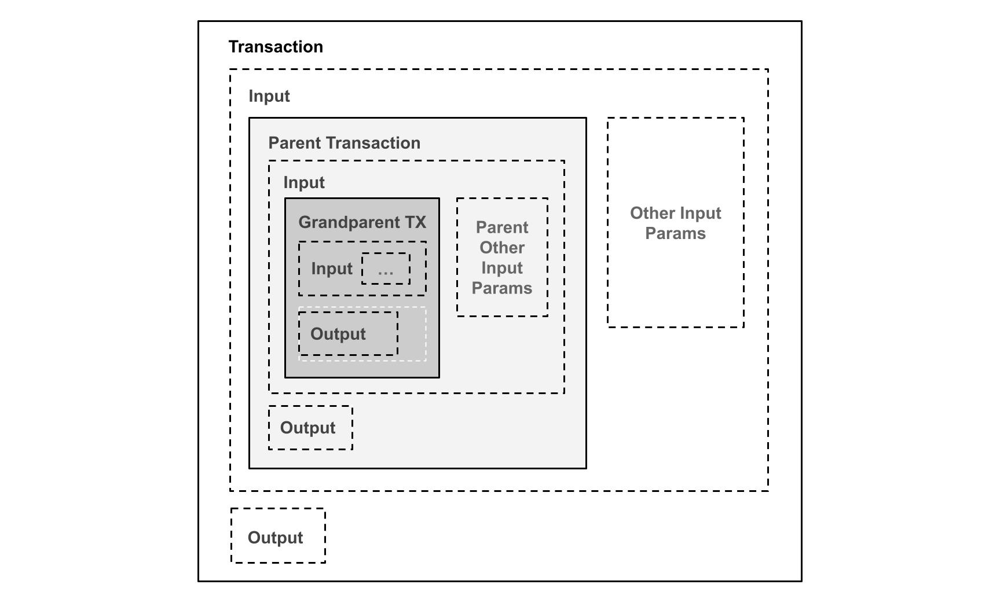

# Radiant: 一种点对点数字资产系统

The Radiant Developers

2022年8月11日

radiantblockchain.org

**摘要：** Radiant网络是一种点对点数字资产系统，它使得价值的直接交换不需要经过中央方。原始的比特币[1]协议提供了创建点对点电子现金系统所需的内容，但缺乏验证交易历史记录的能力，因此无法用于验证数字资产。数字签名和输出约束提供了部分解决方案，但如果仍需要信任第三方来验证数字资产，则主要优势将会丧失。与比特币类似，Radiant网络需要最少的结构，并将交易时间戳为基于哈希的工作证明链。我们引入了两种技术来验证数字资产：唯一引用和通用归纳证明系统，两者都在恒定的O（1）时间和空间内运行。可以以任何方式组合输出，而不会影响未使用交易输出（UTXO）基础架构的固有并行性和性能特征。因此，用户可以随意离开和重新加入Radiant网络，并确保其数字资产的完整性和真实性。

# 1. 引言 

区块链或数字账本技术（DLT）的商业应用往往依赖于发行人和保管人作为可信第三方来验证数字资产。虽然这些系统对于类似电子支付的交易足够有效，但它们仍然存在基于信任模型的固有弱点，因此不适用于高级用途。基于以太坊虚拟机（EVM）[2]的区块链非常灵活，适用于各种程序，但高额的费用使得微支付应用不切实际。

我们需要的是一个电子支付系统，它可以用作具有低费用、高性能和先进编程能力的数字资产管理系统。在本文中，我们提出了一种解决区块链扩展和合约问题的方案，使用两种新颖的技术提供唯一引用和通用归纳证明系统，使跨交易边界的图灵完备[3]程序成为可能。所提出的系统是去中心化的，使用类似比特币的工作量证明共识机制，但具有显著更高的吞吐量水平，同时提供与基于EVM的区块链相同的灵活性，费用非常低。

# 2. 交易

与比特币类似，我们将电子硬币定义为一串数字签名。Radiant中的交易不同之处在于，每个所有者通过数字签名上一个交易的哈希以及解锁硬币所需的输入参数，将硬币转移到下一个所有者。交易还可以创建新的输出锁定约束，其中可能包括下一个所有者的公钥，以及用户定义的任何其他规则。

>图1 Radiant交易
 

为了验证双花，我们使用分布式时间戳服务器，使用基于哈希的工作量证明系统来组织规范历史，以确定哪个交易先到达。交易被组织成块。按照惯例，块中的第一个交易，称为“coinbase交易”，是一种特殊的交易，属于出块矿工挖到的新币。块被链接在一起，并将交易组织成Merkle树[4]。除了第一个交易外，所有交易都必须引用前一个交易，形成一个有向无环图（DAG），其中所有硬币最终都会连接回至少一个块开头的特殊交易。

>**图2** 区块结构；交易组织成Merkle树
 

这种设计在数字资产的背景下存在的问题是，只有一种数字货币或数字资产，没有用户定义数字货币（或数字资产类型）的概念。这种设计对于以币本位计价单位进行电子支付类交易足够好，但并不立即适用于其他类型的数字货币或数字资产。一个常见的解决方案是引入一种服务，如交易索引器，它监视交易中的特殊数据序列以表示数字资产的创建。这种解决方案的问题在于它依赖于运行该服务的公司，需要像网络上的任何其他服务一样信任数字资产的真实性。

我们需要一种方法让用户指示创建自定义数字货币类型，但不依赖于可信服务用于数据呈现。
 
# 3. 数字资产

我们将自定义电子硬币或数字资产定义为一串数字签名。数字资产是一种使用特殊交易标记（称为“assetbase交易”）创建或铸造数字资产的用户自定义币类型。类似于coinbase交易，它将新币注入系统，assetbase交易用唯一的36字节标识符为其生命周期着色或标记硕子货币。自定义数字货币覆盖在基础数字货币类型之上，并以类似的方式运行。assetbase交易可以出现在块的任何位置，并且可以强制执行用户事先决定的任何自定义规则和约束。

>**图 3** 代表用户定义币种类型或数字资产的交易
 

为了实现这一点，我们需要创建一个稳定的唯一标识符和一个交易机制来跟踪数字货币类型（数字资产）的真实性。系统的用户需要有证据证明自定义数字货币类型不是伪造的，并准确地代表数字资产。

>**图 4** 自定义用户定义币种类型由特殊的铸币交易定义，使用唯一标识符来分类币种类型。
 

# 4. 唯一标识符

为了实现硬币类型的唯一标识符，我们使用一种特殊的标记交易，称为“assetbase交易”，它充当数字签名链的开始（铸造）。与需要新数据结构用于唯一标识符不同，我们重用交易标识符和输出索引（称为“outpoint”）作为硬币类型的唯一标识符。可以保证outpoints（36字节）是随机且全局唯一的。

一种名为`OP_PUSHINPUTREF`的编程指令用于附加对输出的引用。该指令接受一个36字节的参数，该参数必须与1）正在使用的输出的outpoint之一匹配，或2）在正在使用的输出之一中先前指定的`OP_PUSHINPUTREF`中已经出现相同的36字节值。任何给定值出现在交易输出中的唯一方法是，通过某个祖先交易，它与初始铸造assetbase交易的outpoint匹配。指定不符合任一条件的值的交易无效。

>**图 5.** 唯一标识符通过匹配一个被花费的输出的输出点来初始化，并在至少一个被花费的输出在脚本体中包含相同的唯一标识符时维护。
 

这种简单的编程指令提供了一个唯一标识符，可以用作稳定引用来创建高级规则。例如，不同的数字货币类型、数字资产现在可以依赖于其他数字货币类型。由于所有数据都是本地交易，通过其直接父输入交易，客户端和服务很容易在O（1）常数时间和空间内验证数字资产的真实性，避免了对可信服务的需求。
# 5. 数学归纳法

可以通过另一种方式创建唯一标识符，并且还提供了一种数学归纳证明机制[5]，即使用修改后的交易哈希算法。通过允许输入脚本接受正在使用的父交易，规则可以验证父交易及其祖父交易符合所需规则。明显的问题是，随着每个完整的父交易被嵌入，指数大小爆炸发生并阻止了该技术的实际使用。我们需要一种方法来压缩交易，以便可以使用固定大小的数据结构来代替派生交易哈希，而不是需要完整的交易内容。

>**图 6** 完整的父交易验证，通过将完整的父交易嵌入到输入中进行数学归纳证明，导致事务大小呈指数级增加。
 

我们可以通过修改比特币中使用的交易哈希算法来实现这一点，其中从序列化交易计算双sha-256摘要，转换为新版本，该版本首先总结交易内容以派生哈希。我们引入了交易哈希算法版本3，以将其与比特币中使用的版本1和版本2区分开来。该过程是对交易的每个字段或组件进行哈希，以获得中间哈希，该中间哈希可用作固定大小的输入，从而避免了指数交易大小增长。

我们使用以下112字节的数据结构，而不是完整的序列化交易字节，然后对其进行双sha-256哈希，最终获得交易哈希。

交易版本3的哈希前像字段包括以下组成部分：
> 1. nVersion(=3) of the transaction (4 byte little endian)
> 2. nTotalInputs (4 byte little endian)
> 3. hashPrevoutInputs (32 byte hash)
> 4. hashSequence (32 byte hash)
> 5. nTotalOutputs (4 byte little endian)
> 6. hashOutputHashes (32 byte hash)
> 7. nLocktime of the transaction (4 byte little endian)

通过使用版本3交易的交易哈希算法，我们能够在每个数学归纳证明的步骤中嵌入父交易和祖父交易，以防止交易大小增加，并可以强制执行任何所需的规则。

>**图 7** 压缩的父交易验证，通过嵌入父交易和祖父交易的事务哈希版本3的前像数据结构来进行数学归纳证明，以强制执行任意规则和约束。
  
 
# 6. 网络

网络拓扑是一个近乎完全图，其中每个挖矿节点都与其他挖矿节点相连。运行网络的步骤与比特币相同，但对于不同的节点类型有所区别：挖矿节点、代理节点、存档节点。挖矿节点是块的活跃发布者，并与所有其他节点保持一致性，存档节点提供历史块数据，代理节点旨在过滤块并跟踪它们服务的应用程序感兴趣的交易。存档和代理节点可以在同一对等网络上运行，但不产生块。非挖矿节点（如存档和代理节点）有时被称为“监听器节点”，以区分它们在网络中的角色。
 

>**图 8** 挖矿节点是良好连接的，并且基于彼此的区块构建。存档节点存储完整的区块以进行历史分析和引导。代理节点是监听节点，过滤和存储交易以为客户提供服务。
 

挖矿节点之间相互连接，形成一个近乎完全图。它们的工作是在彼此的块上建立并维护最近几百个块的共识，并维护UTXO集以防止双重支付。

代理节点只需要存储子集交易，例如特定的硬币类型或数字资产。即使对于大型块，代理节点也可以快速通过引用或特定字节序列过滤交易，然后将这些交易存储以通过应用程序编程接口提供。在合作代理之间，可以公开宣布每个块中与预定模式匹配的交易的Merkle树根哈希，以向其他代理和消费者发出信号，表明该代理已处理了哪些交易。

存档节点用于为各种应用程序创建整个块的备份副本，包括数据仓储、分析和机器学习。存档节点可以补充挖矿节点的引导，并对UTXO集运行定期一致性检查。在撰写本文时，18 TB的商品硬盘售价约为350美元。假设每5分钟有3 GB的数据需要时间戳并分布在网络上，即每天需要732 GB的数据存储量，或每月约22 TB。硬件成本为一年15个硬盘，容量为18 TB，年度增量成本为5,000美元。

# 7. 计算

我们考虑的情景是Radiant网络继续增长，并对挖矿、存档和代理节点的处理需求产生了哪些影响。为了比较，就比特币区块链而言，在撰写本文时，大约有8300万个未使用交易输出（unspent transaction outputs），总计约占据6GB的数据用于防止双重支付。挖矿节点只需要保留最近的几百个区块，而旧区块可以从存档节点中获取。对于代理节点来说，必须保留与其所服务应用程序相关的未使用交易输出的相应部分，扩展性是基于带宽而不是存储需求的函数。

根据我们的假设，每5分钟会产生大小为3GB的区块，这些区块将被时间戳并分布到整个网络中，即每秒大约有20,000笔交易，每笔交易的平均大小为500字节，或者每个区块大约有6,000,000笔交易。对于每种类型的节点，网络能够充分扩展以满足全球需求。这相当于地球上80亿人每5天进行一笔交易。

### 挖矿节点

挖矿节点是唯一构建在其他节点区块之上的节点类型。为了保持共识，只需同步未使用交易输出（UTXO）集，并仅保留最近的大约一百个区块。在撰写本文时，高性能通用固态驱动器可以实现超过120,000 IOPS，价格约为500美元，容量为280GB，因此可以处理大约每秒20,000笔交易（假设每个交易有2个输入和2个输出）。对于每笔交易，有2次读取输入、2次更新输入和2次写入新输出：120,000 / 6 = 20,000笔交易/秒。

### 存档节点

存档节点提供历史区块数据，适用于机器学习、分析和数据仓库应用。存档节点可以为挖矿节点提供引导，并对UTXO集进行定期一致性检查。在撰写本文时，容量为18TB的通用硬盘售价约为350美元。假设每5分钟产生3GB的数据，每天需要732GB的数据存储空间，每月约为22TB。一年的硬件成本是购买15个18TB容量的硬盘，每年的增量成本约为5,000美元。

### 代理节点

在节点类型中，代理节点最容易扩展，因为它们只处理与其所服务应用程序相关的交易类型。因此，代理节点可以从Web服务器扩展到具有有限处理和存储能力的轻量级物联网设备，同时仍能适应3GB的区块或每秒20,000笔交易。例如，一家公司可能希望跟踪其作为数字资产创建的忠诚度积分的使用情况，因此只需要从每个区块中选择与该币种唯一标识符匹配的一小部分交易更新。

在撰写本文时，一种商用计算设备Raspberry Pi 4售价约为275美元，它配备了四核1.5 GHz处理器和4GB的RAM，可用于快速过滤和丢弃不相关的交易，每个核心的处理速度可达5,000笔交易。当然，这只是一个例子，说明处理大区块是多么合理，而在典型的Web应用程序中可能还会有更多可用的核心。

排名前25位的国家中位带宽速度超过100 MBPS，即每秒下载约为10 MB，许多互联网服务提供商还提供无限下载服务。每5分钟3 GB区块的带宽需求约为每秒10 MB，总计每月22 TB。还可以创建代理节点的层次结构，以降低带宽容量较低的代理节点的总带宽需求。

# 8. 结论
 
我们提出了一种在不依赖信任的情况下进行数字资产管理的系统。我们从由数字签名生成的硬币这一基本构建模块开始，这提供了对所有权的强大控制。基于所需的规则和激励机制，我们引入了两种新颖的方法来在常数O(1)的时间和空间内对数字资产进行身份验证和跟踪。这两种方法都独立地提供了一个通用的数学归纳证明系统，可以编码任何可能的数字资产配置。该系统在交易边界内部和跨越交易边界具有图灵完备性，无需依赖第二层协议。Radiant是一种突破性的设计，它既具备了未使用交易输出（UTXO）区块链的性能和并行性优势，又具备了基于以太坊虚拟机（EVM）的基于账户的区块链的合约能力。

# 引用

[1] Satoshi Nakamoto, "Bitcoin: A Peer-to-Peer Electronic Cash System" URL https://bitcoin.org/bitcoin.pdf, 2009.
 
[2] Vitalik Buterin, "Ethereum: A Next-Generation Smart Contract and Decentralized Application Platform." URL https://ethereum.org/en/whitepaper/, 2014.

[3] Wikipedia contributors. "Turing completeness." Wikipedia, The Free Encyclopedia. Wikipedia, The Free Encyclopedia, URL https://en.wikipedia.org/wiki/Turing_completeness, 21 Jul. 2022

[4] R.C. Merkle, "Protocols for public key cryptosystems," In Proc. 1980 Symposium on Security and Privacy, IEEE Computer Society, pages 122-133, April 1980.

[5] Britannica, T. Editors of Encyclopaedia. "mathematical induction." Encyclopedia Britannica, URL https://www.britannica.com/science/mathematical-induction, 2018

 
